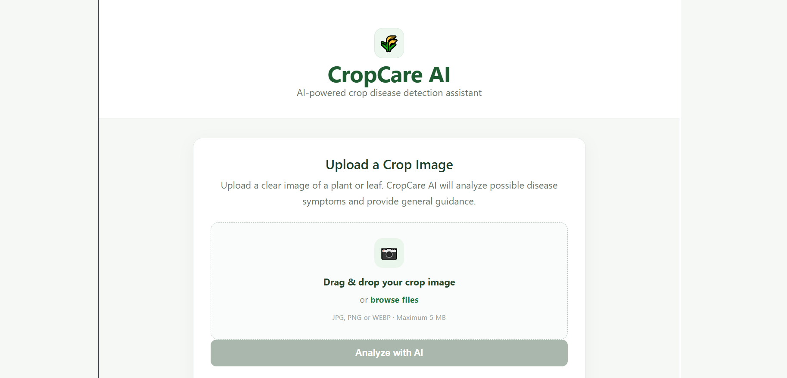
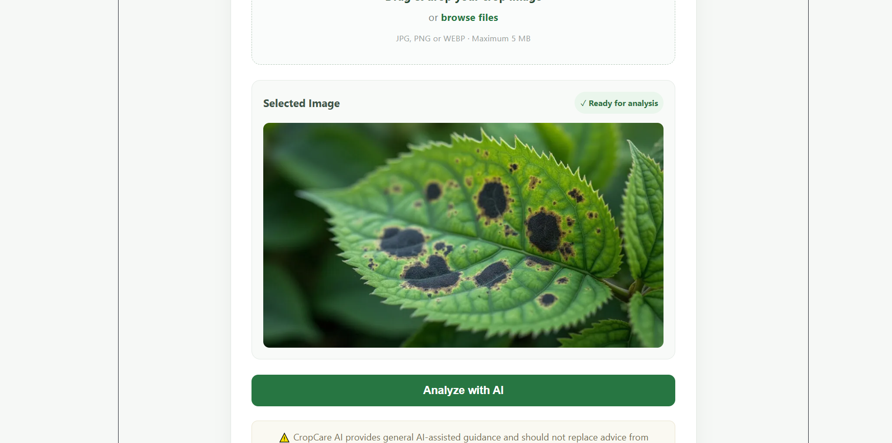
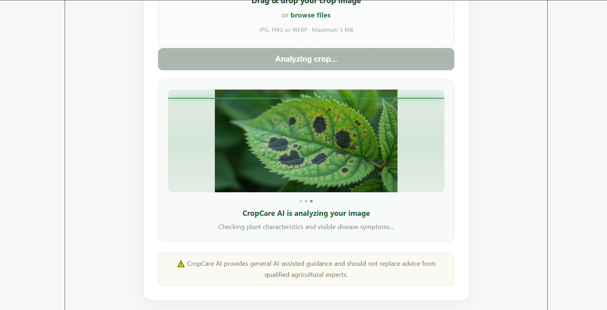
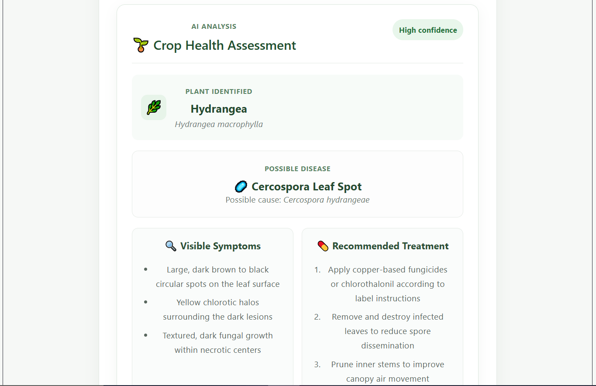
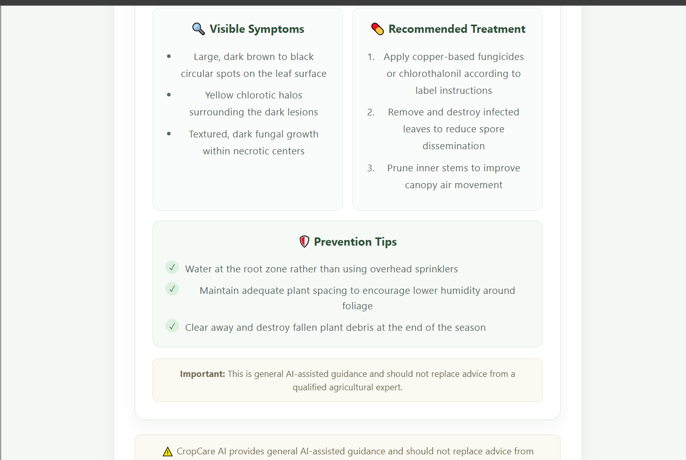

# 🌱 CropCare AI

**AI-powered crop disease detection assistant built with React, Vite, and Google Gemini.**

CropCare AI allows users to upload an image of a plant or leaf and uses Google's Gemini AI to analyze possible crop diseases, visible symptoms, treatment recommendations, and prevention tips.

## 🚀 Live Demo

[Try CropCare AI](https://cropai-alpha.vercel.app)

## 💻 GitHub Repository

[View the source code](https://github.com/poojapasarge03/cropai)

---

## 🎯 Problem

Crop diseases can cause significant agricultural losses. Farmers and plant growers may not always have immediate access to agricultural experts when a plant begins showing signs of disease.

Early identification of possible crop health problems can help users understand potential issues and seek professional advice sooner.

---

## 💡 Solution

CropCare AI is a web-based Generative AI application that provides an initial AI-assisted assessment of plant health.

Users simply upload a clear image of a plant or leaf. Gemini analyzes the image and provides:

- 🌱 Plant identification
- 🔬 Scientific name
- 🦠 Possible disease
- 🧫 Possible pathogen or cause
- 📊 Confidence level
- 🔍 Visible symptoms
- 💊 Recommended treatment
- 🛡️ Prevention tips

The application provides general AI-assisted guidance and does not replace professional agricultural diagnosis.

---

## ✨ Features

- 🌱 AI-powered plant identification
- 🦠 Crop disease detection
- 🔍 Visible symptom analysis
- 💊 Treatment recommendations
- 🛡️ Prevention tips
- 📷 Image upload
- 🖱️ Drag-and-drop upload
- 🔄 Animated AI scanning effect
- 📊 Confidence level
- 📱 Responsive interface
- ⚡ Fast AI analysis
- 🔐 Secure API key handling
- ☁️ Vercel deployment

---

## 🤖 Google Gemini AI

CropCare AI uses the **Google Gemini API** through the `@google/genai` SDK.

The uploaded plant image is sent to the backend, where Gemini analyzes the image using a structured agricultural analysis prompt.

Gemini returns structured information containing:

- Plant name
- Scientific name
- Possible disease
- Pathogen / cause
- Confidence
- Visible symptoms
- Treatment
- Prevention

The backend validates and normalizes the AI response before sending it to the React frontend.

### Why Gemini?

Gemini's multimodal capabilities allow CropCare AI to analyze uploaded plant images together with agricultural instructions provided in the prompt.

---

## 🛠️ Tech Stack

### Frontend

- React
- Vite
- JavaScript
- CSS

### Backend

- Node.js
- Express
- Multer
- CORS

### Artificial Intelligence

- Google Gemini API
- `@google/genai`

### Deployment

- Vercel
- GitHub

---

## 📂 Project Structure

```text
cropai/
│
├── api/
│   └── analyze.js
│
├── public/
│
├── src/
│   ├── App.jsx
│   ├── App.css
│   ├── index.css
│   └── main.jsx
│
├── .gitignore
├── package.json
├── package-lock.json
├── README.md
├── vite.config.js
└── server.js

## 📸 Screenshots

### 🏠 Home Page



### 📤 Upload Crop Image



### 🤖 AI Analysis



### 🌱 Crop Health Assessment



### 🔬 Additional Analysis Result

